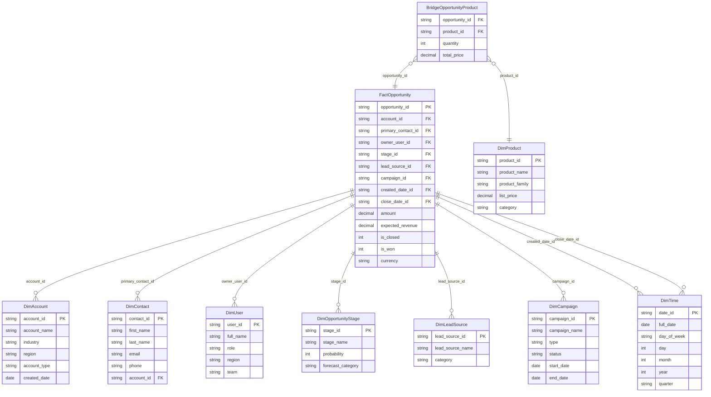

# Bridging Salesforce OLTP to Star Schema for BI

This document describes how to bridge a normalized Salesforce OLTP system with a dimensional star schema used for analytics and business intelligence.

---

## 📊 Key Metrics Enabled (Categorized)

### 🔹 Sales Performance Metrics
- Total Pipeline Value (by Stage, Region, Product, Rep)
- Win Rate (% of Opportunities Closed as Won)
- Number of Closed Deals
- Average Deal Size
- Average Sales Cycle Duration
- Sales Rep Quota Attainment

### 🔹 Forecasting & Revenue Metrics
- Expected Revenue Forecast (Weighted by Probability)
- Revenue Realization vs Forecast
- Stage-to-Stage Conversion Rates
- Forecast Accuracy Over Time

### 🔹 Lead & Campaign Attribution Metrics
- Lead-to-Opportunity Conversion Rate
- Opportunity-to-Close Rate by Lead Source
- Campaign Influence on Revenue
- Marketing ROI per Campaign

### 🔹 Product & Customer Metrics
- Product Penetration by Account
- Cross-Sell & Up-Sell Rate
- Customer Lifetime Value Proxy (by Opportunity Total)
- Opportunity Aging and Stale Pipeline Analysis

### 🔹 Time-Based Metrics
- Opportunities Created vs Closed over Time
- Pipeline Changes by Quarter/Month
- Daily Snapshot of Sales Funnel by Stage

---

## 🧩 Detailed Star Schema (Mermaid)

---

## 🛠 Tooling Stack

| Component         | Tool Example                      |
|-------------------|-----------------------------------|
| Extraction        | Salesforce Bulk API, Fivetran     |
| Staging           | S3, Azure Blob, Raw DB tables     |
| Data Warehouse    | Snowflake, BigQuery, Synapse      |
| Transformation    | dbt, ADF Data Flow, Databricks    |
| Orchestration     | Airflow, ADF Pipelines            |
| BI & Reporting    | Power BI, Tableau, Looker         |

---

## 🧠 Best Practices

- Use a **date spine** for reliable time-series reporting.
- Apply **SCD Type 2** logic for historical tracking on dimensions.
- Snapshot `Opportunity` records daily or at key milestones.
- Ensure surrogate keys are used in the warehouse for dimensional joins.
- Regularly validate row counts and data freshness between OLTP and warehouse layers.

---

This model supports scalable, trustworthy analytics for forecasting, sales optimization, marketing attribution, and customer behavior tracking.
