# Salesforce CRM Galaxy Schema for Enterprise Analytics

This document outlines a galaxy (fact constellation) schema built around Salesforce and related business systems. The schema supports sales, marketing, service, and product analytics by integrating multiple fact tables with shared dimensions.

---

## 🌌 Overview of Star Schemas in the Galaxy

### 1. 🔹 FactOpportunity (Sales Pipeline)
Tracks potential revenue and pipeline health.

- **Grain:** One row per opportunity stage/status.
- **Key Metrics:**
  - Total Pipeline Value — *scalar*
  - Win Rate by Region — *vector*
  - Expected Revenue Forecast — *vector*
  - Deal Conversion Matrix (Lead Source × Stage) — *matrix*

---

### 2. 🔹 FactQuote (Quoting Activity)
Tracks issued quotes and pricing behavior.

- **Grain:** One row per quote per version.
- **Key Metrics:**
  - Average Discount by Product Family — *vector*
  - Quote-to-Order Conversion Rate — *scalar*
  - Active Quotes by Rep and Region — *matrix*

---

### 3. 🔹 FactOrder (Orders & Fulfillment)
Tracks confirmed orders and revenue backlog.

- **Grain:** One row per order per customer.
- **Key Metrics:**
  - Total Orders by Quarter — *vector*
  - Revenue Backlog by Product — *vector*
  - Fulfillment Lag (Order Date → Ship Date) — *scalar*

---

### 4. 🔹 FactCase (Service Requests)
Tracks customer support and field service.

- **Grain:** One row per service case.
- **Key Metrics:**
  - Average Resolution Time by Region — *vector*
  - First Contact Resolution Rate — *scalar*
  - Case Volume Matrix (Type × Status) — *matrix*

---

### 5. 🔹 FactActivity (Tasks & Engagements)
Tracks rep activity: emails, calls, tasks.

- **Grain:** One row per activity logged.
- **Key Metrics:**
  - Calls per Rep per Day — *matrix*
  - Follow-up Rate — *scalar*
  - Engagement Velocity (Time between touches) — *vector*

---

### 6. 🔹 FactAsset (Installed Base)
Tracks delivered and serviced products.

- **Grain:** One row per asset instance per customer.
- **Key Metrics:**
  - Active Asset Count by Model — *vector*
  - Avg Age of Installed Products — *scalar*
  - Serviceable Units by Region & Status — *matrix*

---

### 7. 🔹 FactCampaignResponse (Marketing Attribution)
Tracks lead interactions with campaigns.

- **Grain:** One row per campaign-contact interaction.
- **Key Metrics:**
  - Conversion Rate by Campaign — *vector*
  - Attributed Revenue (First/Last/Even) — *vector*
  - Channel Effectiveness Matrix (Channel × Region) — *matrix*

---

### 8. 🔹 FactInvoice / FactPayment (Billing)
Tracks financial transactions and collections.

- **Grain:** One row per invoice/payment.
- **Key Metrics:**
  - AR Aging Buckets — *vector*
  - DSO (Days Sales Outstanding) — *scalar*
  - Collection Rate by Rep and Quarter — *matrix*

---

## 📐 Shared Dimensions

| Dimension        | Description                         |
|------------------|-------------------------------------|
| `DimAccount`      | Customer, business unit             |
| `DimUser`         | Sales rep, service agent            |
| `DimProduct`      | Elevator, service plan, spare part  |
| `DimTime`         | Standard calendar dimension         |
| `DimRegion`       | Geo hierarchy (Region > Country)    |
| `DimCampaign`     | Marketing campaign metadata         |
| `DimStatus`       | Status descriptors (case, asset)    |
| `DimChannel`      | Email, phone, web, trade show       |

---

## 🧠 Best Practices

- Apply **surrogate keys** for dimension joins to ensure consistency across facts.
- Use **SCD Type 2** on slowly changing dimensions (e.g., Account Type, Product Category).
- Create **bridge tables** for multi-valued joins (e.g., Quote ↔ Product).
- Implement **snapshot logic** for point-in-time tracking (e.g., Opportunity status daily).

---

This galaxy schema provides a scalable, multi-process analytical foundation for sales, service, marketing, and financial reporting.

```mermaid
erDiagram

%% Core Fact Tables
FactOpportunity ||--o{ DimAccount : "account_id"
FactOpportunity ||--o{ DimUser : "owner_user_id"
FactOpportunity ||--o{ DimProduct : "product_focus_id"
FactOpportunity ||--o{ DimTime : "created_date_id"
FactOpportunity ||--o{ DimTime : "close_date_id"
FactOpportunity ||--o{ DimRegion : "region_id"
FactOpportunity ||--o{ DimCampaign : "campaign_id"

FactQuote ||--o{ DimAccount : "account_id"
FactQuote ||--o{ DimUser : "rep_user_id"
FactQuote ||--o{ DimProduct : "product_id"
FactQuote ||--o{ DimTime : "quote_date_id"
FactQuote ||--o{ DimRegion : "region_id"

FactOrder ||--o{ DimAccount : "account_id"
FactOrder ||--o{ DimProduct : "product_id"
FactOrder ||--o{ DimTime : "order_date_id"
FactOrder ||--o{ DimRegion : "region_id"

FactCase ||--o{ DimAccount : "account_id"
FactCase ||--o{ DimUser : "agent_user_id"
FactCase ||--o{ DimTime : "case_open_date_id"
FactCase ||--o{ DimRegion : "region_id"
FactCase ||--o{ DimStatus : "case_status_id"

FactActivity ||--o{ DimUser : "user_id"
FactActivity ||--o{ DimAccount : "account_id"
FactActivity ||--o{ DimTime : "activity_date_id"
FactActivity ||--o{ DimRegion : "region_id"

FactAsset ||--o{ DimAccount : "account_id"
FactAsset ||--o{ DimProduct : "product_id"
FactAsset ||--o{ DimRegion : "region_id"
FactAsset ||--o{ DimStatus : "asset_status_id"
FactAsset ||--o{ DimTime : "install_date_id"

FactCampaignResponse ||--o{ DimCampaign : "campaign_id"
FactCampaignResponse ||--o{ DimTime : "response_date_id"
FactCampaignResponse ||--o{ DimChannel : "channel_id"
FactCampaignResponse ||--o{ DimRegion : "region_id"

FactInvoice ||--o{ DimAccount : "account_id"
FactInvoice ||--o{ DimTime : "invoice_date_id"
FactInvoice ||--o{ DimRegion : "region_id"

FactPayment ||--o{ DimAccount : "account_id"
FactPayment ||--o{ DimTime : "payment_date_id"
FactPayment ||--o{ DimRegion : "region_id"

%% Shared Dimensions
DimAccount {
    string account_id PK
    string account_name
    string industry
    string country
}

DimUser {
    string user_id PK
    string full_name
    string role
    string region_id FK
}

DimProduct {
    string product_id PK
    string product_name
    string category
}

DimTime {
    string date_id PK
    date full_date
    string month
    int year
    string quarter
}

DimRegion {
    string region_id PK
    string region_name
    string country
}

DimCampaign {
    string campaign_id PK
    string name
    string type
}

DimChannel {
    string channel_id PK
    string channel_name
}

DimStatus {
    string status_id PK
    string status_name
    string status_type
}
```

