# 📊 Metrics README

This document outlines the full set of **business and operational metrics** modeled across the enterprise Galaxy Schema for TKE.

Metrics are grouped by domain and tied to their respective **fact tables** (OLAP layer), enabling robust analytics and executive reporting. Each metric is classified by **type**:
- **Scalar** – A single aggregated value (e.g., total revenue)
- **Vector** – Aggregated by one dimension (e.g., margin by region)
- **Matrix** – Aggregated by two dimensions (e.g., cost by department and time)

These metrics serve multiple business functions:
- Sales performance tracking
- Marketing attribution and ROI
- Customer service optimization
- Financial reconciliation (AR, cost centers)
- Management accounting and allocation analysis
- Cross-system analytics (Salesforce + SAP)

This document complements the **OLAP diagram** and supports BI layer implementation (Power BI, Tableau, etc.).

## 1. Sales & Pipeline Metrics (from Salesforce FactOpportunity)
| Metric                        | Type   | Description                                   |
|-------------------------------|--------|-----------------------------------------------|
| Total Pipeline Value          | Scalar | Sum of open opportunity Amount               |
| Expected Revenue              | Vector | Weighted by probability                       |
| Win Rate by Region            | Vector | Won / (Won + Lost), grouped by Region         |
| Deal Conversion Matrix        | Matrix | Lead Source × Stage transition counts         |
| Sales Cycle Duration          | Scalar | Avg days from open to close                   |
| Avg Deal Size                 | Scalar | Avg Amount for closed-won                     |
| Pipeline Coverage Ratio       | Scalar | Pipeline / Quota                              |
| Opportunity Aging             | Vector | Days open per opportunity                     |
| Lost Deal Reasons             | Vector | Count by LostReason field                     |

## 2. Quote & Order Metrics (FactQuote, FactOrder)
| Metric                         | Type   | Description                                     |
|--------------------------------|--------|-------------------------------------------------|
| Average Discount               | Vector | % discount from list price                      |
| Quote-to-Order Conversion Rate | Scalar | Quotes converted to orders                      |
| Order Volume by Product        | Vector | Quantity or count by product                    |
| Fulfillment Lag                | Scalar | Days between order and delivery                 |

## 3. Marketing Attribution Metrics (FactCampaignResponse)
| Metric                     | Type   | Description                                          |
|----------------------------|--------|------------------------------------------------------|
| Campaign Conversion Rate   | Vector | Responses / Total Reach                              |
| Attributed Revenue         | Vector | SFDC opportunity revenue linked to campaign          |
| Channel Effectiveness      | Matrix | Revenue or leads per channel × region                |
| Cost per Lead              | Vector | Campaign Spend / Leads generated                     |
| Marketing ROI              | Scalar | (Revenue - Spend) / Spend                            |

## 4. Customer Service & Asset Metrics (FactCase, FactAsset)
| Metric                         | Type    | Description                                 |
|--------------------------------|---------|---------------------------------------------|
| Average Resolution Time        | Vector  | Case closure duration by region             |
| First Contact Resolution Rate  | Scalar  | % resolved on first contact                 |
| Active Installed Base          | Vector  | Count of current assets in field            |
| Maintenance Cost per Asset     | Vector  | Service cost aggregated by asset ID         |
| Case Volume by Type and Status | Matrix  | For backlog, SLA tracking                   |

## 5. Rep Activity & Engagement Metrics (FactActivity)
| Metric                        | Type   | Description                                |
|-------------------------------|--------|--------------------------------------------|
| Calls/Emails per Rep per Day  | Matrix | Activity type × day × rep                  |
| Follow-up Rate                | Scalar | % of leads followed up within X days       |
| Engagement Velocity           | Vector | Avg time between touches                   |
| Open Tasks Aging              | Vector | Days since assignment                      |

## 6. Finance & Billing Metrics (FactInvoice, FactPayment)
| Metric                     | Type   | Description                                  |
|----------------------------|--------|----------------------------------------------|
| Total Invoiced Amount      | Scalar | Sum of InvoiceAmount                         |
| AR Aging Buckets           | Vector | 0–30, 31–60, 61–90, >90 days                 |
| Collection Rate            | Vector | Paid / Invoiced by period                    |
| DSO (Days Sales Outstanding)| Scalar| AR ÷ Avg Daily Revenue                       |
| Invoice-to-Cash Cycle      | Scalar | Days from invoice to payment                 |

## 7. Management Accounting Metrics (FactCost, FactRevenue, FactAllocation)
| Metric                        | Type         | Description                                    |
|-------------------------------|--------------|------------------------------------------------|
| Gross Margin                  | Scalar/Vector| Revenue - Direct Cost (by Product/Region)      |
| Contribution Margin           | Vector       | Revenue - Variable Cost                        |
| Budget vs Actual              | Matrix       | Time × Account × Cost Center                   |
| Fixed vs Variable Cost Ratio  | Scalar       | % of each cost type                            |
| Cost per Unit Installed       | Scalar       | Total cost / Installations                     |
| Operating Expense by Department| Matrix      | Department × Period                            |
| Vendor Spend Analysis         | Vector       | Total spend by Vendor Category                 |
| Inter-Cost Center Allocations | Matrix       | From → To amount allocations                   |
| CAPEX by Region               | Vector       | Total capital expenditure per region           |

## 8. Cross-System Metrics (Salesforce + SAP)
| Metric                           | Type   | Description                                    |
|----------------------------------|--------|------------------------------------------------|
| Forecasted Revenue vs Actual Cost| Vector | SFDC pipeline vs SAP GL                        |
| Budget Variance                  | Matrix | Budgeted vs Actual by region/product           |
| Profitability by Customer/Region | Vector | SFDC Revenue - SAP Cost                        |
| YOY Growth (Revenue/Cost)        | Vector | Year-over-year trend line                      |

# 📈 OLAP Metrics Diagram – Galaxy Schema Overview

This diagram represents the OLAP layer for a **Galaxy Schema** architecture designed for TKE, integrating metrics across **Salesforce**, **SAP**, and other enterprise systems. 

Each fact table (e.g., `FactOpportunity`, `FactCost`, `FactInvoice`) is modeled as a **star schema**, and the constellation of these facts forms a **Galaxy Schema**.

---

## 🌀 Galaxy Architecture Notes

- **Fact Tables:** Represent core business processes (e.g., Sales Pipeline, Campaign Response, Invoicing, Cost Accounting).
- **Shared Dimensions:** `DimTime`, `DimRegion`, `DimProduct`, `DimAccount`, and `DimCurrency` serve as **wormholes**, enabling cross-fact analysis.
- **Metrics:** Grouped by business domain, classified as scalar, vector, or matrix.
- **Integration Points:**
  - Salesforce ↔ SAP revenue/cost alignment
  - Marketing ↔ Opportunity influence tracking
  - Finance ↔ Cost center reporting and allocations

---

## 🧭 Example Wormholes (Shared Dimensions)

| Wormhole Dimension | Used In                                      |
|---------------------|----------------------------------------------|
| `DimTime`           | All fact tables — time alignment              |
| `DimProduct`        | Opportunity, Quote, Order, Revenue, Cost      |
| `DimRegion`         | Opportunity, Campaign, Cost, Revenue          |
| `DimAccount`        | CRM (Sales), Invoicing, Costing               |
| `DimCurrency`       | Finance, Revenue, Cost — for FX normalization|

---

## 🔧 Usage

The following Mermaid diagram maps each **metric** to its source **fact table**, forming a visual OLAP layer to support:
- Executive dashboards
- Departmental KPIs
- Financial consolidation
- Cross-system audits and reconciliations

Continue below for the visual structure.

```mermaid
graph TD
    %% Clusters for Fact Tables and Metrics
    
    subgraph Sales_and_Pipeline["Sales & Pipeline"]
        direction LR
        FO[FactOpportunity]
        FO --> M1[Total Pipeline Value]
        FO --> M2[Expected Revenue]
        FO --> M3[Win Rate by Region]
        FO --> M4[Deal Conversion Matrix]
        FO --> M5[Sales Cycle Duration]
        FO --> M6[Avg Deal Size]
        FO --> M7[Pipeline Coverage Ratio]
        FO --> M8[Opportunity Aging]
        FO --> M9[Lost Deal Reasons]
    end

    subgraph Quote_and_Order["Quote & Order"]
        direction LR
        FQ[FactQuote]
        FOd[FactOrder]
        FQ --> M10[Average Discount]
        FQ --> M11[Quote-to-Order Conversion Rate]
        FOd --> M12[Order Volume by Product]
        FOd --> M13[Fulfillment Lag]
    end

    subgraph Marketing["Marketing"]
        direction LR
        FC[FactCampaignResponse]
        FC --> M14[Campaign Conversion Rate]
        FC --> M15[Attributed Revenue]
        FC --> M16[Channel Effectiveness]
        FC --> M17[Cost per Lead]
        FC --> M18[Marketing ROI]
    end

    subgraph Service_Asset["Service & Asset"]
        direction LR
        FCA[FactCase]
        FA[FactAsset]
        FCA --> M19[Average Resolution Time]
        FCA --> M20[First Contact Resolution Rate]
        FA --> M21[Active Installed Base]
        FA --> M22[Maintenance Cost per Asset]
        FCA --> M23[Case Volume by Type and Status]
    end

    subgraph Rep_Activity["Rep Activity"]
        direction LR
        FAT[FactActivity]
        FAT --> M24[Calls/Emails per Rep per Day]
        FAT --> M25[Follow-up Rate]
        FAT --> M26[Engagement Velocity]
        FAT --> M27[Open Tasks Aging]
    end

    subgraph Finance["Finance"]
        direction LR
        FI[FactInvoice]
        FP[FactPayment]
        FI --> M28[Total Invoiced Amount]
        FI --> M29[AR Aging Buckets]
        FP --> M30[Collection Rate]
        FI --> M31[DSO]
        FP --> M32[Invoice-to-Cash Cycle]
    end

    subgraph Management_Accounting["Management Accounting"]
        direction LR
        FCst[FactCost]
        FR[FactRevenue]
        FAlo[FactAllocation]
        FR --> M33[Gross Margin]
        FR --> M34[Contribution Margin]
        FCst --> M35[Budget vs Actual]
        FCst --> M36[Fixed vs Variable Cost Ratio]
        FCst --> M37[Cost per Unit Installed]
        FCst --> M38[Operating Expense by Department]
        FCst --> M39[Vendor Spend Analysis]
        FAlo --> M40[Inter-Cost Center Allocations]
        FCst --> M41[CAPEX by Region]
    end

    subgraph Cross_System["Cross-System (Salesforce + SAP)"]
        direction LR
        CM[CrossMetrics]
        CM --> M42[Forecasted Revenue vs Actual Cost]
        CM --> M43[Budget Variance]
        CM --> M44[Profitability by Customer/Region]
        CM --> M45[YOY Growth]
    end

    %% Shared Dimensions (Wormholes)
    subgraph Shared_Dimensions["Shared Dimensions (Wormholes)"]
        direction TB
        DimTime[DimTime]
        DimRegion[DimRegion]
        DimProduct[DimProduct]
        DimAccount[DimAccount]
        DimCurrency[DimCurrency]
        DimCustomer[DimCustomer]
        DimChannel[DimChannel]
        DimCostCenter[DimCostCenter]
        DimCampaign[DimCampaign]
    end

    %% Connect Fact tables to Shared Dimensions (wormholes)

    FO --> DimTime
    FO --> DimRegion
    FO --> DimProduct
    FO --> DimAccount
    FO --> DimCampaign

    FQ --> DimTime
    FQ --> DimRegion
    FQ --> DimProduct
    FQ --> DimAccount

    FOd --> DimTime
    FOd --> DimRegion
    FOd --> DimProduct
    FOd --> DimAccount
    FOd --> DimCurrency

    FC --> DimTime
    FC --> DimRegion
    FC --> DimChannel
    FC --> DimCampaign
    FC --> DimCustomer

    FCA --> DimTime
    FCA --> DimRegion
    FCA --> DimAccount

    FA --> DimTime
    FA --> DimRegion
    FA --> DimProduct
    FA --> DimAccount

    FAT --> DimTime
    FAT --> DimRegion
    FAT --> DimAccount

    FI --> DimTime
    FI --> DimRegion
    FI --> DimAccount
    FI --> DimProduct
    FI --> DimCurrency

    FP --> DimTime
    FP --> DimRegion
    FP --> DimAccount
    FP --> DimCurrency

    FCst --> DimTime
    FCst --> DimRegion
    FCst --> DimProduct
    FCst --> DimAccount
    FCst --> DimCurrency
    FCst --> DimCostCenter

    FR --> DimTime
    FR --> DimRegion
    FR --> DimProduct
    FR --> DimAccount
    FR --> DimCurrency

    FAlo --> DimTime
    FAlo --> DimCostCenter
    FAlo --> DimAccount
    FAlo --> DimCurrency

    CM --> DimTime
    CM --> DimRegion
    CM --> DimAccount

```

